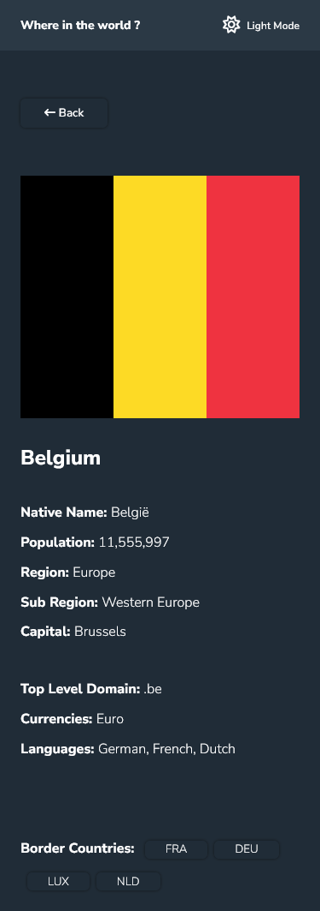
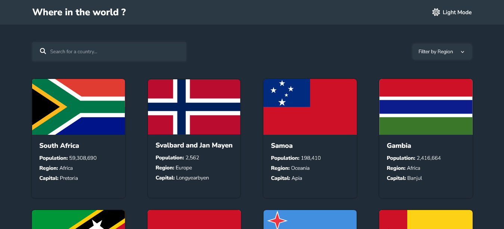

# Frontend Mentor - REST Countries API with color theme switcher solution

This is a solution to the [REST Countries API with color theme switcher challenge on Frontend Mentor](https://www.frontendmentor.io/challenges/rest-countries-api-with-color-theme-switcher-5cacc469fec04111f7b848ca). Frontend Mentor challenges help you improve your coding skills by building realistic projects.

## Table of contents

- [Overview](#overview)
  - [The challenge](#the-challenge)
  - [Screenshot](#screenshot)
  - [Links](#links)
  - [Built with](#built-with)
  - [What I learned](#what-i-learned)
  - [Continued development](#continued-development)
- [Author](#author)

## Overview

### The challenge

Users should be able to:

- See all countries from the API on the homepage
- Search for a country using an `input` field
- Filter countries by region
- Click on a country to see more detailed information on a separate page
- Click through to the border countries on the detail page
- Toggle the color scheme between light and dark mode _(optional)_

### Screenshot

- Mobile HomePage `Light`

- Mobile HomePage `Dark`

- Mobile CountryDetails `Light`

- Mobile CountryDetails `Dark`

- Desktop HomePage `Light`

- Desktop HomePage `Dark`

- Desktop CountryDetails `Dark`

- Desktop CountryDetails `Light`

### Links

- Live Site URL: [@via Vercel](https://api-restcountries.vercel.app/)
- Live Site URL: [@via Netlify](https://api-restcountries.netlify.app/)
- Solution URL: [@via frontend mentor](https://www.frontendmentor.io/challenges/rest-countries-api-with-color-theme-switcher-5cacc469fec04111f7b848ca/hub)

### Built with

- [React](https://reactjs.org/) - JS library
- [Vite](https://vitejs.dev/) - Build tool
- [React-Router v.6](https://reactrouter.com/en/main) - Routing & fetching data from API
- Semantic HTML5 markup
- CSS custom properties
- Flexbox & Grid
- JSX syntax
- Hooks (useEffect, useNavigate, useParams)

### What I learned

To think more in react logic and deal with REST-API, and to fetch data through `ReactRouter` v.6 and navigate between countries in the same page (when click on some border country it navigates to that country without refreshing the page)

### Continued development

Build more projects with Reactjs

## Author

- Website - [Ragaboga](https://github.com/RagaBoGaa)
- Frontend Mentor - [@RagaBoGaa](https://www.frontendmentor.io/profile/RagaBoGaa)
